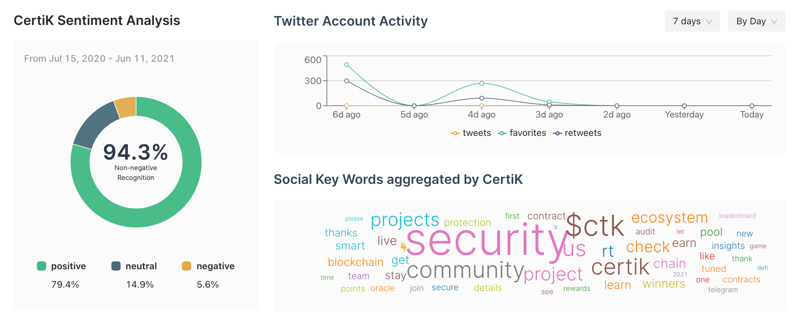

# Tweet-Sentiment-Analysis

Here is the link to a demo: https://sharp-hawking-0892ce.netlify.app/

##### How to start the web application

The web application is created with create-react-app. In the `sentiment-analysis-dashboard` folder, run `npm install` and `npm start`. The web application will look like this.

##### How to grab all tweets and run sentiment analysis

In the `tweet-dumper` folder, run `pip install -r requirements.txt`. Then get your `Bearer Token` from [twitter developer portal](developer.twitter.com/en/portal), put it in `bearer_token` in `main.py` and run it. When it finishes, it will generate a `certikorg_tweet_analysis.json` file. It will also put this file to `sentiment-analysis-dashboard/src` folder, then refresh the web dashboard and it will load with the new analysis data.

